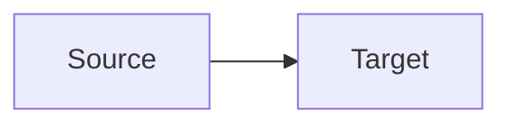

# Mermaid Diagrams (CSA)

## Schema

[`schema.json`](schema.json)

## Purpose

Diagrams are **required deliverables**, not optional decoration. Missing a required diagram ID = Completeness FINAL **FAIL** with `target_agent_id` so Manager re-runs the owner (or Completeness FINAL again if artifacts are rich but render omitted the diagram).

## Rendering rules (mandatory)

### Markdown (`.md`)

````markdown

````

Rules:
- Opening fence exactly `` ```mermaid `` on its own line; closing `` ``` `` alone.
- Prefer `flowchart` / `sequenceDiagram` / `C4Context` / `C4Container` / `C4Component`.
- Node IDs: alphanumeric + underscore only.
- Content from accepted artifacts only — no invented systems/queues.

### HTML (`csa_pack/arc42-c4/*.html`) — reliable runtime (HARD)

ESM `import` from CDN often fails (401/CORS/`file://`). **Do not rely on ESM-only init.**

Use classic script + explicit run:

```html
<pre class="mermaid">
flowchart TB
  A[Actor] --> B[System]
</pre>
<script src="https://cdn.jsdelivr.net/npm/mermaid@11/dist/mermaid.min.js"></script>
<script>
  mermaid.initialize({ startOnLoad: false, theme: "neutral", securityLevel: "loose" });
  mermaid.run({ querySelector: "pre.mermaid" });
</script>
```

Fallback CDN if primary blocked: `https://unpkg.com/mermaid@11/dist/mermaid.min.js`.

Rules:
- Diagram source in `<pre class="mermaid">` (raw `-->`, no HTML-escaped arrows).
- Every HTML page with diagrams includes the runtime scripts before `</body>`.
- Still **write** the Mermaid source even if CDN is unreachable — source presence is the gate; browser CDN 401 must not omit diagrams from the files.

## Required CSA diagrams (ALL blocking)

| ID | Location | Type | Owner if substance missing |
|----|----------|------|----------------------------|
| `diag-exec-overview` | `Executive_Summary.md` | flowchart TB | discover / tech_architecture |
| `diag-domain-context-map` | `Business_Architecture.md` | flowchart | business_domain |
| `diag-runtime` | `Application_Architecture.md` | flowchart or sequenceDiagram | tech_architecture |
| `diag-lineage-critical` | `Data_and_Integration.md` | flowchart LR | data_lineage |
| `diag-integration-landscape` | `Data_and_Integration.md` | flowchart or sequenceDiagram | integration |
| `diag-c4-context` | `arc42-c4/context.html` | C4Context or flowchart | tech_architecture (`c4_views`) |
| `diag-c4-containers` | `arc42-c4/containers.html` | C4Container or flowchart | tech_architecture |
| `diag-c4-components` | `arc42-c4/components.html` | C4Component or flowchart | tech_architecture |

**Also on `arc42-c4/index.html` (hub):** ≥2 `<pre class="mermaid">` blocks (exec overview + C4 context at minimum) + classic Mermaid runtime. Missing hub diagrams = FAIL (`completeness_validator` if artifacts rich; else `tech_architecture` for empty `c4_views`).

Optional extras (not blocking): `diag-capability-map` on Business_Architecture.

## Completeness checks (blocking)

1. Each required ID present in the correct file.
2. Markdown fences use language `mermaid`.
3. HTML uses `<pre class="mermaid">` + classic `mermaid.min.js` init + `mermaid.run`.
4. `index.html` has ≥2 Mermaid blocks.
5. On fail: set `target_agent_id`, `rerun_recommended`, `schema_fields_missing` / diagram id in `blocking_gaps`.

## Anti-patterns

- ASCII-only boxes when Mermaid is required
- Markdown Mermaid without `mermaid` language tag
- HTML with ESM-only CDN and no classic script fallback
- Omitting diagrams because CDN returned 401
- Invented nodes not in artifacts
