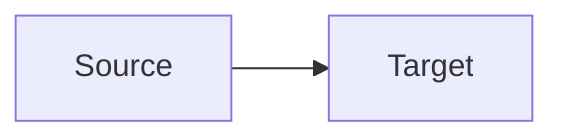

# Mermaid Diagrams (CSA)

## Schema

Diagram inventory + render contract: [`schema.json`](schema.json)

## Purpose

Diagrams improve understanding of current-state architecture. Every required diagram must be **valid Mermaid** and use the correct fence/container so it renders in Markdown viewers and in the HTML C4 pack.

## Rendering rules (mandatory)

### Markdown (`.md`)

Use a fenced code block with language `mermaid` only — no indentation inside the fence that breaks parsers:

````markdown

````

Rules:

- Opening fence must be exactly `` ```mermaid `` on its own line.
- Closing fence `` ``` `` on its own line.
- No HTML comments wrapping the fence.
- Prefer `flowchart` / `sequenceDiagram` / `C4Context` / `C4Container` / `C4Component` over exotic types.
- Node IDs: alphanumeric + underscore only (no spaces in IDs). Labels go in quotes or brackets.
- Do not invent systems, queues, packages, or externals not present in accepted CSA artifacts.

### HTML (`csa_pack/arc42-c4/*.html`)

1. Put diagram source in:

```html
<pre class="mermaid">
flowchart TB
  ...
</pre>
```

2. Include Mermaid runtime once per page (before `</body>`):

```html
<script type="module">
  import mermaid from "https://cdn.jsdelivr.net/npm/mermaid@11/dist/mermaid.esm.min.mjs";
  mermaid.initialize({ startOnLoad: true, theme: "neutral", securityLevel: "loose" });
</script>
```

3. Escape rule: inside `<pre class="mermaid">`, do **not** HTML-escape arrows (`-->`); keep raw Mermaid text. Avoid `</pre>` inside diagram labels.

4. Prefer relative page chrome; Mermaid CDN is allowed solely for browser rendering of diagrams.

## Required CSA diagrams

| ID | Location | Type | Source artifacts |
|----|----------|------|------------------|
| `diag-c4-context` | `arc42-c4/context.html` | `C4Context` or `flowchart` | domain + integration + architecture |
| `diag-c4-containers` | `arc42-c4/containers.html` | `C4Container` or `flowchart` | architecture + discovery |
| `diag-c4-components` | `arc42-c4/components.html` | `C4Component` or `flowchart` | architecture (critical CMP-* only) |
| `diag-domain-context-map` | `Business_Architecture.md` | `flowchart` | domain (`business_domains`, cross-deps) |
| `diag-lineage-critical` | `Data_and_Integration.md` | `flowchart LR` | lineage (critical entity/system flows) |
| `diag-integration-landscape` | `Data_and_Integration.md` | `flowchart` or `sequenceDiagram` | integration |
| `diag-exec-overview` | `Executive_Summary.md` | `flowchart TB` | discovery + architecture (coarse overview) |

Optional when evidence exists:

| ID | Location | Type |
|----|----------|------|
| `diag-runtime` | `Application_Architecture.md` | `flowchart` or `sequenceDiagram` |
| `diag-capability-map` | `Business_Architecture.md` | `flowchart` |

## Quality bar

- Every required diagram present and parseable as Mermaid.
- Diagram nodes/edges must trace to accepted machine IDs or evidence — no decorative fiction.
- If evidence is thin, draw a smaller diagram and state gaps in prose next to it; do not invent missing externals.
- Keep diagrams readable: ≤ ~25 nodes per diagram; split rather than clutter.

## Anti-patterns

- ASCII-only boxes when Mermaid is required
- Mermaid in Markdown without the `mermaid` language tag
- HTML diagrams without `<pre class="mermaid">` + init script
- Hardcoded customer package/queue/system names not found in artifacts
- Mixing PlantUML or Graphviz in place of Mermaid for required IDs
